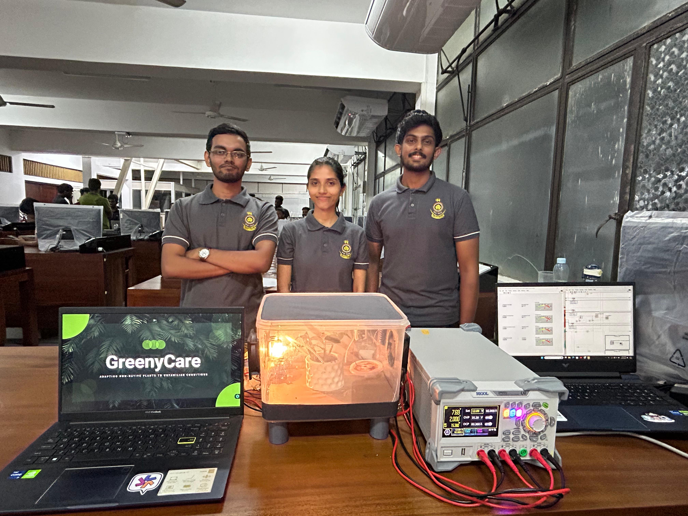
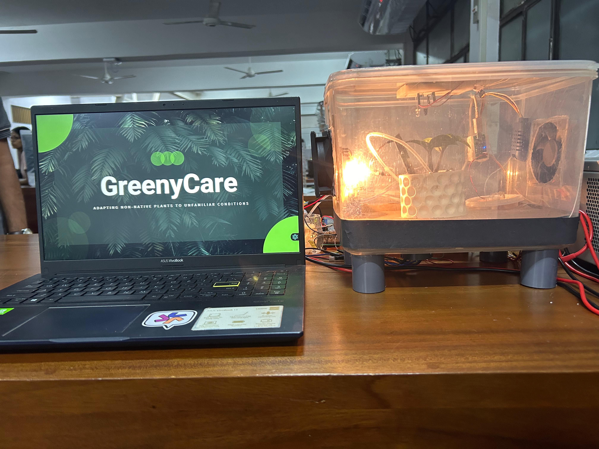

# GreenyCare
GreenyCare is a group project completed by three members as part of the Electrical Measurements and Instrumentation (EE2044) module during semester 4.

## Introduction
Greeny Care is a fully automated system designed to create ideal environmental conditions for plant growth. It manages humidity, temperature, soil moisture, and monitors water pH before irrigating the plants. By using multiple sensors and actuators, the system ensures that the plants are housed in a perfectly controlled, isolated environment.

## System Overview
Greeny Care integrates several sensors and actuators to monitor and adjust the internal environment of a 28cm x 20cm box.

## Our Team


### Sensors Used
- **LM35 Temperature Sensor**: Measures the internal temperature of the box.
- **AMT1001 Humidity Sensor**: Measures the humidity level inside the box.
- **Capacitive Soil Moisture Sensor**: Monitors soil moisture content.
- **pH Sensor**: Measures the pH level of water before it is used to water the plants.
- **Customized IR Sensor**: Measures plant height to monitor growth.

### Actuators Used
- **12V DC Fans (2)**: Regulate temperature by circulating air.
- **Humidifier**: Adds moisture to the air if humidity drops.
- **Halogen Bulb**: Provides heat when temperatures fall below the required threshold.
- **Water Pump**: Activates when soil moisture and water pH levels are within the desired range to water the plants.

## Functionalities

### Environmental Control
- **Temperature Regulation**:
  - If the temperature exceeds the set point, one DC fan activates to cool the box by drawing air into the the box.
  - If the temperature is too low, the halogen bulb automatically turns on to increase the temperature.

- **Humidity Regulation**:
  - If humidity drops, the humidifier increases moisture.
  - If humidity is too high, the second DC fan expels the moist air and pulls in drier air from outside.

- **Soil Moisture Management**:
  - If soil moisture is low, the system checks the pH level of the water.
  - If the pH level is suitable, the water pump activates to water the plants.

### pH Level Monitoring
- The pH sensor checks if the water is within an optimal range for plant growth.
- If the pH level is not desirable, the system alerts the user by turning on an external light.

### Plant Growth Monitoring
- **Customized IR Sensor**: 
  - Measures the height of the plant.
  - Provides data to the user to assess the growth rate and overall health of the plant.
 
 ##Overview


## Installation

### Hardware Setup
1. Assemble the sensors and actuators as per the design.
2. Connect the sensors (LM35, AMT1001, Capacitive Soil Moisture Sensor, pH Sensor, and IR Sensor) to the controller.
3. Connect the actuators (DC Fans, Humidifier, Halogen Bulb, Water Pump) to the controller.
4. Ensure the box is fully isolated from the external environment to maintain controlled conditions.

### Software Setup
1. Clone the repository:
    ```sh
    https://github.com/gajindu20/GreenyCare
    ```
2. Upload the provided code to your microcontroller using the Arduino IDE or any compatible IDE.
3. Configure the system parameters such as optimal temperature, humidity, and pH levels in the code.
4. Power on the system and monitor the conditions through the connected sensors.

## Usage
- **Monitoring**: The system continuously monitors temperature, humidity, soil moisture, and pH levels.
- **Automatic Adjustments**: Based on sensor readings, the system automatically adjusts the internal environment using the actuators.
- **User Alerts**: If conditions are not optimal, the system alerts the user through external indicators (e.g., lights).

## Contributions
Feel free to contribute to the development of Greeny Care by submitting pull requests or opening issues in the repository.
